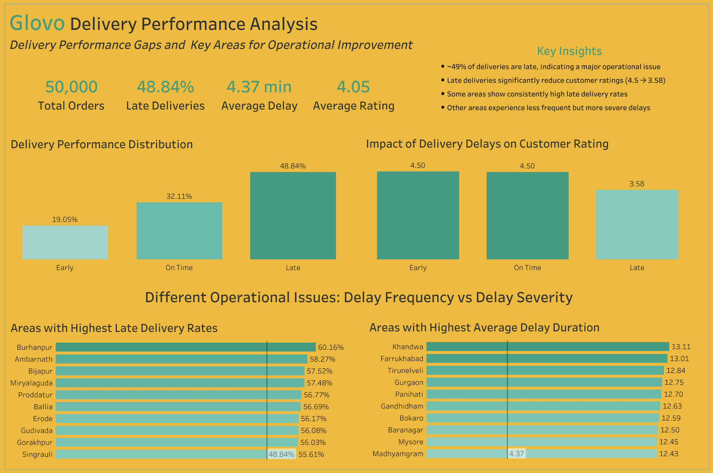

# Glovo Delivery Performance Analysis

## Project Overview

This project analyzes delivery performance data from Glovo India to identify key operational issues affecting delivery reliability and customer satisfaction.

The objective is to uncover patterns in late deliveries, assess their impact on customer ratings, and identify specific areas where operational improvements can be made.

## Business Problem

Glovo aims to improve delivery performance and customer satisfaction.

A significant proportion of deliveries are delayed, which may negatively impact customer experience. Understanding the root causes and identifying where delays occur most frequently is essential for improving operational efficiency.

This analysis answers the following question:

**How can Glovo reduce late deliveries and improve overall delivery performance?**

## Dataset

The dataset contains 50,000 delivery records and includes information such as:

- Order details: order_id, order_date
- Customer information: customer_id, customer_segment
- Delivery data: promised vs actual delivery time, delivery performance
- Operational metrics: distance, delivery time in minutes, area
- Customer feedback: rating, sentiment, feedback category

## Tools Used

- SQL: Data cleaning and analysis
- Tableau: Data visualization 
- Excel / CSV: Data handling and initial exploration

## Key Insights

- ~49% of deliveries are late, indicating a major operational issue  
- Late deliveries significantly reduce customer ratings: 4.5 → 3.58
- Some areas show consistently high late delivery rates 
- Other areas experience less frequent but more severe delays

Analysis revealed two distinct patterns in delivery performance. Some areas experience a high frequency of late deliveries, indicating reliability issues. Other areas show lower late delivery rates but significantly higher delay durations when delays occur, suggesting occasional but severe operational breakdowns.

 ## Dashboard

The Tableau dashboard provides a comprehensive overview of delivery performance, including:

- KPI summary: Total Orders, Late Delivery Rate, Average Delay, Average Rating
- Distribution of delivery performance: Early, On Time, Late
- Impact of delays on customer ratings
- Identification of areas with highest late delivery rates
- Identification of areas with highest delay duration

## Recommendations

The following recommendations are based on the identified delivery performance patterns and aim to improve both reliability and customer satisfaction.

- ### Increase courier allocation in high late delivery areas to improve reliability
  Use demand forecasting to better align courier supply with peak order volumes. Pre position drivers in high demand zones to reduce waiting times and improve delivery punctuality. Improving On Time performance is expected to increase customer satisfaction and ratings.

- ### Optimize routing and dispatching strategies in underperforming areas
  Although dispatch level data was not available in this dataset, improving routing and dispatch logic is a key operational lever in delivery performance. Assigning orders to the closest available driver, incorporating real time traffic conditions, and introducing buffer times during peak hours can help reduce delays and improve delivery reliability.

- ### Address areas with high delay severity through targeted operational interventions
  Areas with extreme delay durations should be analyzed separately to identify root causes such as long distances, traffic bottlenecks, or operational inefficiencies. Implement targeted solutions such as route optimization, delivery zone adjustments, or driver training.

- ### Integrate customer ratings as a core operational performance metric
  Use customer ratings as a key KPI to monitor delivery quality. Since late deliveries significantly impact ratings, incorporating this metric into performance tracking can help align operational decisions with customer satisfaction outcomes.

## Conclusion

The analysis shows that late deliveries is an issue that significantly impacts customer satisfaction.

By focusing on both high frequency delay areas and high severity delay areas, Glovo can implement targeted operational improvements to enhance delivery performance and customer experience.

## Limitations & Further Analysis Opportunities

- **Driver level performance could not be evaluated**  
  While it would be valuable to assess whether certain drivers consistently underperform, the dataset assigns a unique identifier to each delivery instance rather than a persistent driver ID. This prevents tracking individual driver performance over time.

- **Dispatching process could not be analyzed**  
  The dataset does not include information on dispatch timing, assignment logic, or driver allocation. As a result, it was not possible to evaluate how dispatch decisions impact delivery delays.

- **Short-term retention analysis limitations**  
  While customer return behavior was explored, no significant differences were observed between delivery performance groups. This suggests that late deliveries may not immediately impact repeat purchases. However, potential long term behavioral effects, such as changes in ordering frequency or customer churn over time, could not be fully assessed within the scope of this dataset.

