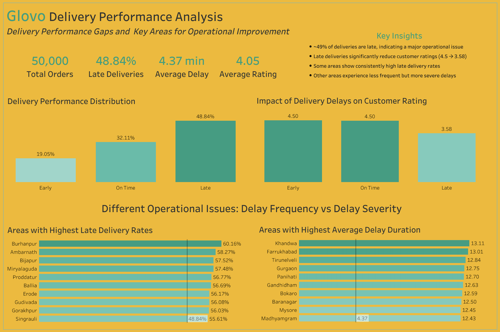

# Glovo Delivery Performance Analysis

## Project Overview

This project presents an operations and logistics performance analysis. The reason behind it was based on a strong interest in understanding how data can be used to identify operational challenges and uncover opportunities to improve business performance.

Using delivery data from Glovo (India market), sourced from Kaggle, i explore operational patterns with the objective of providing inisghts into the factors driving late deliveries and lower customer ratings.

**The scenario used for the project is hypothetical and was developed solely for educational and portfolio purposes.**

## Project Structure

[Introduction](#introduction)

[Business Problem](#business-problem)

[Dataset](#dataset)

[Tools Used](#tools-used)

[Data Cleaning & Transformation](#data-cleaning--transformation)

[Dashboard](#dashboard)

[Key Insights](#key-insights)

[Analysis](#analysis)

[Conclusion](#conclusion)

[Recommendations](#recommendations)

[Limitations & Further Analysis Opportunities](#limitations--further-analysis-opportunities)

## Introduction

In highly competitive, time sensitive marketplaces, delivery reliability is a critical driver of customer satisfaction and platform performance. Even small inefficiencies in operations can scale rapidly, leading to delays, decreased service quality, and potential customer churn.

As a leading Q-Commerce platform, Glovo relies heavily on efficient logistics and timely deliveries to maintain a strong customer experience.
Yet, maintaining consistent delivery performance at scale remains a significant operational challenge, particularly in complex and high demand urban environments, as showcased in this analysis.

## Business Problem

### Scenario

Despite the importance of timely deliveries, Glovo has found themselves in a situation where a substantial share of orders are completed after promised delivery time. 

The operations manager has become concerned about the increasing numbers of late deliveries fearing they could reduce customer ratings and ultimately lead to higher customer churn.
She has therefore requested my help to identify the key factors driving these issues and provide recommendations to improve delivery reliability and customer experience.

To address this challenge, it was essential to move beyond surface level metrics and understand where delays occur most frequently, how severe they are, and what underlying factors contribute to them.

### The analysis was guided by the following main question:

**How can Glovo reduce late deliveries while ensuring a positive customer experience?**

To facilitate this, the analysis incorporated three supporting questions:

- How do delivery delays impact customer ratings?
- Which areas experience the highest share of late deliveries?
- Which operational patterns are most associated with delayed deliveries?

## Tools Used

- Excel / CSV: Data handling and initial exploration
- SQL: Data cleaning, transformation, and analysis
- Tableau: Data visualization

## Data Cleaning & Transformation

**Excel**

The dataset was sourced from Kaggle and downloaded as a CSV file. Excel was used for initial inspection of the data, including reviewing column structures, checking for inconsistencies, and performing a high level exploration including filtering, aggregations, and pivot tables before moving into a more robust analysis environment.

The original dataset can be accessed and downloaded here: [Raw Data](https://github.com/andrebergvind/glovo-delivery-performance-analysis/blob/main/orders_details_raw_data.csv)

**SQL** 

Following the initial inspection, SQL was used to prepare the data for analysis. Using PostgreSQL, the dataset was cleaned by correcting data types and removing duplicate columns.
In addition, to facilitate the analysis, new columns were created, such as delivery time differences and delivery performance categories, (Early, On Time, Late).
The full SQL cleaning and transformation process can be accessed here: [SQL Cleaning](https://github.com/andrebergvind/glovo-delivery-performance-analysis/blob/main/sql-cleaning)

The transformed dataset can be accessed and downloaded here:
[Clean Data](https://github.com/andrebergvind/glovo-delivery-performance-analysis/blob/main/glovo_analysis_clean_data.csv)

With the data cleaned and transformed, SQL was also used to perform exploratory analysis, aggregations, and segmentations to identify patterns in delivery performance to uncover key operational insights. Among other factors, the analysis examined the impact of time of day, day of week, and order size on delivery performance. The full SQL analysis queries can be accessed here: [SQL Analysis](https://github.com/andrebergvind/glovo-delivery-performance-analysis/blob/main/sql-analysis)

**Tableau**

Ultimately, the dataset was transferred into Tableau, which was used to build interactive dashboards that visualise delivery performance and key metrics.
The tool enabled the creation of KPI summaries, distribution charts, and geographic comparisons, allowing for clear communication of insights.
Following the discoveries made through the SQL analysis, the dashboard focuses on highlighting the operational areas most greatly affecting delivery performance at this time.

 ## Dashboard

[View Interactive Dashboard](https://public.tableau.com/views/GlovoE-CommerceAnalysis/Dashboard1?:language=en-GB&:sid=&:redirect=auth&:display_count=n&:origin=viz_share_link)

## Key Insights

- Approximately 49% of orders are delivered later than promised.
- Late deliveries inevitably affect customer ratings negatively
- While late deliveries overall represents a problem for Glovo, the analysis reveals that some areas experience them more frequently, while others suffer from more severe delays.

## Analysis

Glovos current delivery performance is evidentially far below its expectations. Out of 50,000 orders, approximately 49% were recorded as late, meaning that almost one in every second customer receives their order later than promised. 

As a result of late deliveries, the average customer rating inevitably declines. Orders with late deliveries consistently receive lower ratings than early or on-time deliveries.

Yet, due to the limitations of the data 

In order to identify potential drivers behind delivery delays, the analysis explored several operational dimensions, including time of day, day of week, order size, and geographic area performance. While some variation was observed across time periods and order characteristics, these factors did not reveal sufficiently strong or consistent patterns to explain the overall scale of delays.

Instead, the most meaningful insights emerged from the geographic analysis where two distinct patterns were highlighted.
First, some areas consistently experienced a high share of late deliveries, suggesting persistent operational inefficiencies rather than isolated incidents. This may indicate structural challenges such as courier supply imbalances, inefficient delivery coverage, or sustained demand pressure within specific zones.

Second, other areas displayed lower frequencies of late deliveries but instead significantly higher average delay durations when delays did occur. This suggests that some operational issues may not occur frequently, but when they do, they create severe disruptions to delivery performance. Potential contributing factors may include traffic congestion, longer travel distances, routing inefficiencies, or temporary overload during peak demand periods.

These findings become particularly relevant when analysing customer satisfaction outcomes. The data shows a clear relationship between delivery performance and customer ratings, with average ratings declining from approximately 4.5 for on-time or early deliveries to 3.58 for late deliveries. The dropping customer ratings clearly suggest that delivery reliability is not only an operational KPI, but also a direct driver of customer perception and platform experience.

However, although the analysis was able to identify specific areas associated with poorer delivery performance, the dataset does not allow for definitive conclusions regarding the exact operational causes behind these delays.

One important limitation is that couriers were assigned new identifiers for each individual delivery rather than persistent driver IDs. As a result, it was not possible to evaluate whether delays were linked to specific recurring driver level performance.

Additionally, the dataset did not contain dispatch level information such as courier assignment timing, driver availability, or real-time traffic conditions. This limits the ability to fully explain why certain areas consistently underperform compared to others.
Therefore, while the analysis successfully identifies where operational challenges are most concentrated and how they impact customer satisfaction, further operational data would be required to determine the precise root causes behind these delivery inefficiencies.

## Conclusion

Following the analysis, findings demonstrate that late deliveries represent a significant operational challenge for Glovo with approximately 49% of all orders being delivered after the promised time. Given the time sensitive nature of Q-Commerce, it comes as no surprise that customer ratings are directly affected by late deliveries, seeing customer ratings declining as delivery performance worsens.

However, to identify the exact issues driving these delays 

While customer return behavior was explored, no significant churn was observed from customers receiving their orders late. 
Although this insight suggests that late deliveries may not immediately impact short-term repeat purchases, potential long term behavioral effects can not be dismissed, and would require a more lonngitudinal analysis, examining data over an extended time period.

However, notable is that delivery performance issues cannot be approached through a single generalised solution. Different areas appear to experience different types of operational challenges, requiring more targeted interventions depending on whether the primary issue relates to delay frequency, delay severity, or broader operational instability.

What we can establish however, is that these issues certainly affect overall customer satisfaction and reliability.
As customer satisfaction declines, delivery delays evolve from being purely an operational inefficiency into a broader business risk, which could directly affect customer retention, brand perception, and long term revenue potential.

Overall, the analysis suggests that location-based operational performance is one of the strongest indicators of delivery reliability within the dataset. Therefore, by identifying underperforming areas and understanding the nature of their delivery issues, Glovo would be better positioned to prioritise operational improvements and allocate resources more effectively.

## Recommendations

The following recommendations are based on the identified delivery performance patterns and aim to improve both reliability and customer satisfaction.

- ### Increase courier allocation in high late frequency delivery areas to improve reliability
  Use demand forecasting to better align courier supply with peak order volumes. Pre position drivers in high demand zones to reduce waiting times and improve delivery punctuality. Improving On Time performance is expected to increase customer satisfaction and ratings.

- ### Optimize routing and dispatching strategies in underperforming areas
  Although dispatch level data was not available in this dataset, improving routing and dispatch logic is a key operational lever in delivery performance. Assigning orders to the closest available driver, incorporating real time traffic conditions, and introducing buffer times during peak hours can help reduce delays and improve delivery reliability.

- ### Address areas with high delay severity through targeted operational interventions
  Areas with extreme delay durations should be analyzed separately to identify root causes such as long distances, traffic bottlenecks, or operational inefficiencies. Implement targeted solutions such as route optimization, delivery zone adjustments, or driver training.

- ### Operationalize customer ratings as a leading performance signal, not just an outcome metric
  Customer ratings should be actively integrated into operational decision making, rather than used solely as a post delivery feedback metric. 
  Delivery delays are clearly associated with poorer ratings, according to the data, suggesting that operational performance has a direct impact on customer satisfaction. Glovo could leverage this to detect high risk areas early and prioritise targeted interventions by connecting ratings with delivery time data at the area and time level.

## Limitations & Further Analysis Opportunities

- **Driver level performance could not be evaluated**  
  While it would be valuable to assess whether certain drivers consistently underperform, the dataset assigns a unique identifier to each delivery instance rather than a persistent driver ID. This prevents tracking individual driver performance over time.

- **Dispatching process could not be analysed**  
  The dataset does not include information on dispatch timing, assignment logic, or driver allocation. As a result, it was not possible to evaluate how dispatch decisions impact delivery delays.

- **Short-term retention analysis limitations**  
  To fully assess customer churn, a longitudinal analysis would be required, using a data over an extended time period.

